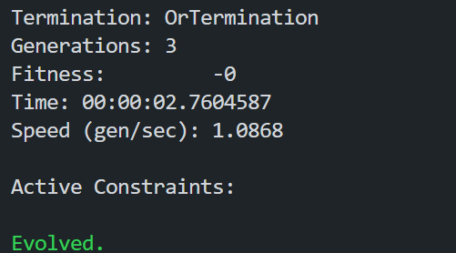
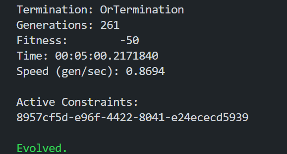

# Informe de Optimización de Calendarios

## Proyecto Planficación del cronograma de deportes en los juegos Caribe


## Autores:

- **Massiel Paz Otaño** (C312) [@NinaSayers](https://github.com/NinaSayers)
- **Marlon Díaz Pérez** (C312) [@MarlonDPerez](https://github.com/MarlonDPerez)
- **Albaro Suárez Valdes** (C312) [@Albaros02](https://github.com/Albaros02)

## Índice

- [Informe de Optimización de Calendarios](#informe-de-optimización-de-calendarios)
  - [Proyecto Planficación del cronograma de deportes en los juegos Caribe](#proyecto-planficación-del-cronograma-de-deportes-en-los-juegos-caribe)
  - [Autores:](#autores)
  - [Índice](#índice)
  - [Introducción](#introducción)
  - [Planificación del Cronograma de Deportes en los Juegos Caribe: Optimización con Algoritmos Genéticos](#planificación-del-cronograma-de-deportes-en-los-juegos-caribe-optimización-con-algoritmos-genéticos)
  - [Estado del Arte en la Construcción de Calendarios con Restricciones](#estado-del-arte-en-la-construcción-de-calendarios-con-restricciones)
    - [Técnicas Híbridas en la Solución de Problemas de Calendarización](#técnicas-híbridas-en-la-solución-de-problemas-de-calendarización)
    - [Algoritmos Genéticos en la Construcción de Calendarios](#algoritmos-genéticos-en-la-construcción-de-calendarios)
    - [Justificación del Uso de Algoritmos Genéticos en el Proyecto](#justificación-del-uso-de-algoritmos-genéticos-en-el-proyecto)
  - [Algoritmos de Optimización Aplicados](#algoritmos-de-optimización-aplicados)
  - [Formulación del Problema y Restricciones](#formulación-del-problema-y-restricciones)
    - [Datos de Entrada](#datos-de-entrada)
    - [Pasos del Algoritmo Genético \[1\]](#pasos-del-algoritmo-genético-1)
  - [Formulación Matemática](#formulación-matemática)
    - [Conjuntos y Parámetros:](#conjuntos-y-parámetros)
    - [Variables de Decisión:](#variables-de-decisión)
    - [Función Objetivo:](#función-objetivo)
    - [Restricciones:](#restricciones)
  - [Bibliotecas y Herramientas Usadas](#bibliotecas-y-herramientas-usadas)
    - [Principales Características](#principales-características)
  - [Modo de Uso](#modo-de-uso)
    - [Manual de Usuario](#manual-de-usuario)
    - [Ejemplos de Ejecución](#ejemplos-de-ejecución)
  - [Reporte Técnico](#reporte-técnico)
  - [Conclusiones](#conclusiones)
  - [Referencias](#referencias)

## Introducción

## Planificación del Cronograma de Deportes en los Juegos Caribe: Optimización con Algoritmos Genéticos

La organización eficiente de eventos deportivos de gran escala, como los Juegos Caribe (juegos deportivos de la Universidad de La Habana), presenta un desafío complejo. La planificación de un cronograma que satisfaga las necesidades de múltiples deportes, las limitaciones de tiempo y las restricciones de recursos requiere una solución sistemática y optimizada. La ausencia de herramientas digitales para este propósito en la Universidad de La Habana, organizadora de los Juegos Caribe, dificulta la planificación manual, imponiendo una carga significativa en el proceso. 

Este informe explora el desarrollo del proyecto *CalendarBuilder*, una aplicación que emplea algoritmos genéticos para optimizar la planificación del cronograma deportivo en los Juegos Caribe. El proyecto busca resolver el problema de asignar deportes a sesiones específicas en días determinados, cumpliendo con restricciones como la disponibilidad de recursos, preferencias y capacidades. 

El problema se caracteriza por la existencia de dos tipos de sesiones diarias (mañana y tarde), lo que exige que las restricciones de coincidencia entre deportes se cumplan para maximizar la utilidad del calendario. El uso de algoritmos genéticos, capaces de explorar soluciones complejas, permite encontrar soluciones óptimas para este problema, lo que facilita la organización de los Juegos Caribe y libera a la Universidad de La Habana de la compleja tarea de realizar una planificación manual.

## Estado del Arte en la Construcción de Calendarios con Restricciones

La construcción de calendarios con restricciones ha sido objeto de investigación durante décadas debido a su complejidad y su amplia aplicabilidad en diversos campos como la planificación académica, la asignación de turnos laborales, y la organización de eventos. El problema consiste en asignar eventos a intervalos de tiempo respetando un conjunto de restricciones, como la disponibilidad de recursos, la no superposición de eventos, las prioridades o secuencias entre actividades, entre otras.

Los métodos tradicionales para abordar este problema incluyen técnicas como **programación lineal entera (ILP)**, **búsqueda exhaustiva**, y **backtracking**. Si bien estas técnicas pueden ser efectivas para instancias pequeñas o moderadamente complejas, su desempeño se degrada rápidamente cuando se aplican a problemas de mayor escala o con un número elevado de restricciones. A medida que los problemas de calendarización se vuelven más complejos, ha habido una transición hacia el uso de técnicas más avanzadas como los **algoritmos evolutivos**, los **métodos de satisfacción de restricciones (CSP)**, y más recientemente, las **técnicas híbridas**.

### Técnicas Híbridas en la Solución de Problemas de Calendarización

Las técnicas híbridas combinan enfoques diversos para resolver los problemas de calendarización, aprovechando las fortalezas de cada método y compensando sus debilidades. Estas técnicas suelen integrar algoritmos de búsqueda local, heurísticas, y métodos de optimización, a menudo junto con métodos basados en inteligencia artificial. La combinación de técnicas clásicas con enfoques más recientes, como el **machine learning**, permite crear calendarios de manera más eficiente y adaptativa, especialmente en escenarios dinámicos o donde las restricciones pueden cambiar en tiempo real.

El enfoque híbrido es ideal para resolver problemas de gran escala, ya que puede reducir el tiempo de búsqueda al mezclar componentes de optimización global (como la programación lineal o la optimización por restricciones) con algoritmos de búsqueda local o evolutiva. Esto es especialmente útil cuando el problema presenta múltiples restricciones complejas y variables interdependientes, como suele ser el caso en los calendarios.

### Algoritmos Genéticos en la Construcción de Calendarios

En este contexto, los **algoritmos genéticos** (AG) han ganado popularidad debido a su capacidad para abordar problemas altamente complejos y no lineales, como la construcción de calendarios. Los AG son una clase de algoritmos evolutivos que se inspiran en los principios de la selección natural de Darwin, utilizando un enfoque basado en poblaciones para generar soluciones. A través de operadores como la **selección**, el **cruce (crossover)** y la **mutación**, los AG exploran grandes espacios de búsqueda para encontrar soluciones que cumplan con las restricciones del problema.

Los algoritmos genéticos son particularmente adecuados para problemas de calendarización con múltiples restricciones debido a su capacidad para adaptarse a la **naturaleza combinatoria** del problema. A diferencia de los métodos deterministas como la programación lineal, los AG pueden encontrar soluciones subóptimas rápidamente y mejorar la calidad de las soluciones a través de generaciones sucesivas. Esto los hace efectivos para escenarios donde se necesita flexibilidad y capacidad de búsqueda en un espacio de soluciones altamente multidimensional.

### Justificación del Uso de Algoritmos Genéticos en el Proyecto

En este proyecto, se utiliza un algoritmo genético para la construcción de calendarios debido a su capacidad para manejar múltiples restricciones y su flexibilidad frente a la complejidad del problema. Al tratarse de un problema que involucra la asignación de eventos a intervalos de tiempo y la satisfacción de diversas restricciones, los algoritmos genéticos ofrecen una forma efectiva de explorar el espacio de soluciones sin verse limitados por la necesidad de una estructura lineal o simplificada. Además, los AG pueden adaptarse a **escenarios dinámicos** donde las restricciones cambian con el tiempo, lo que es esencial en la planificación de calendarios de eventos.

El enfoque basado en algoritmos genéticos permite que el sistema se beneficie de su capacidad de **explorar diversas soluciones** simultáneamente, aumentando las posibilidades de encontrar un calendario que maximice la satisfacción de las restricciones sin necesidad de recurrir a una búsqueda exhaustiva. En este contexto, los algoritmos genéticos ofrecen un enfoque robusto y escalable para problemas de gran envergadura, donde las soluciones óptimas pueden no ser triviales o fáciles de encontrar usando métodos tradicionales.

Por lo tanto, el uso de algoritmos genéticos en este proyecto no solo está alineado con las tendencias actuales en la resolución de problemas de calendarización con restricciones, sino que también aporta un enfoque flexible y eficiente que puede adaptarse a la complejidad creciente del problema.

## Algoritmos de Optimización Aplicados

Para resolver este problema, se utilizó un enfoque basado en algoritmos genéticos similar a como se presenta en el estudio [2]. Dado el amplio espacio de búsqueda generado por la asignación de deportes a sesiones con múltiples restricciones, los algoritmos genéticos proporcionan una solución eficiente. Esta técnica es particularmente útil para encontrar soluciones óptimas en la planificación de recursos con restricciones complejas, como la asignación de deportes para los Juegos Caribe en un período determinado.

## Formulación del Problema y Restricciones

### Datos de Entrada

Los datos de entrada para el problema de optimización del calendario son los siguientes:

1. **Días del Evento**: Intervalo de tiempo del evento deportivo (día de inicio de los Juegos Caribe, y día de culminación).
2. **Deportes Disponibles**: Lista de deportes a programar.
3. **Restricciones de Coincidencia**: Definen qué deportes no pueden coincidir en el mismo rango de sesiones predefinido (por ejemplo: si entre el football y el baseball deben haber 3 sesiones, no pueden programarse una competencia de football y otra de baseball en 2 días consecutivos o el mismo día. Es importante tener en cuenta que cada día cuenta con 2 sesiones).
4. **Cantidad de Sesiones**: Número de sesiones por día que deben ser ocupadas por cada deporte.

### Pasos del Algoritmo Genético [1]

1. **Población Inicial**:
   - Se generan múltiples soluciones iniciales de forma aleatoria, donde cada solución es un calendario que cumple mínimamente las restricciones.

2. **Evaluación de Fitness**:
   - Cada calendario se evalúa mediante una función de fitness personalizada que mide qué tan bien se cumplen las restricciones. Los principales criterios de evaluación incluyen:
     - Satisfacer las restricciones de coincidencia entre eventos.
     - Asignar correctamente los deportes según el número de sesiones requeridas para cada uno.
     - Optimizar la distribución de eventos, minimizando conflictos y maximizando la eficiencia en el uso de recursos.
   - La función de fitness está diseñada para recibir cualquier tipo de objeto, siempre que pueda convertirse en un "Cromosoma" y viceversa. Esto aporta una mayor flexibilidad en la definición de las restricciones, permitiendo adaptaciones dinámicas en función de las necesidades del problema.   

3. **Selección (Elite Selection)**:
   - Se aplica el método de **selección elitista**, donde un porcentaje de las mejores soluciones, basadas en su fitness, se selecciona directamente para la siguiente generación. Esto garantiza que las soluciones de mayor calidad se mantengan en el proceso evolutivo.

4. **Cruce (Uniform Crossover)**:
   - Las soluciones seleccionadas se combinan utilizando el **cruce uniforme**, en el cual los genes (sesiones y eventos del calendario) se seleccionan aleatoriamente de ambos padres para crear descendientes. Este método permite una mayor diversidad genética, ya que cada hijo puede heredar características de cualquiera de los dos progenitores de manera equitativa.

5. **Mutación (Uniform Mutation)**:
   - Se introduce **mutación uniforme**, en la que cualquier parte del calendario (como la asignación de un deporte a una sesión) tiene una pequeña probabilidad de ser modificada. Este tipo de mutación ayuda a explorar nuevas soluciones y previene que el algoritmo quede atrapado en óptimos locales.

6. **Evaluación y Evolución**:
   - Las nuevas soluciones generadas se vuelven a evaluar utilizando la función de fitness. El proceso de selección, cruce y mutación se repite a lo largo de varias generaciones, mejorando progresivamente la calidad de las soluciones encontradas hasta que se cumplan la mayoría de las restricciones, o se alcance un criterio de parada como el número máximo de iteraciones o un límite de tiempo.

7. **Solución Final**:
   - Al finalizar las iteraciones, el algoritmo devuelve la mejor solución encontrada: un calendario optimizado que respeta tantas restricciones como sea posible dentro de los límites definidos. La calidad de la solución depende de los parámetros de fitness, la diversidad genética introducida por la mutación y el cruce, y la presión selectiva ejercida a lo largo del proceso.

Este enfoque permite que el algoritmo genético, utilizando técnicas de selección elitista, cruce y mutación uniforme, y una evaluación de fitness personalizada, produzca una solución que equilibre la flexibilidad en la búsqueda de soluciones y el respeto de las restricciones establecidas.

## Formulación Matemática

La formulación matemática para este problema de optimización de asignación de deportes al calendario puede representarse como un problema de programación entera o programación lineal mixta (MILP). Los objetivos y restricciones clave se centran en la asignación de deportes a sesiones de manera que se respeten tanto las condiciones de aparición de cada deporte como las restricciones de coincidencia de deportes en sesiones cercanas.

### Conjuntos y Parámetros:

- \( $\mathcal{D} = \{1, 2, \dots, m\}$\): Conjunto de días del evento, donde \( m \) es el número total de días.
- \( $\mathcal{S} = \{1, 2\}$ \): Conjunto de sesiones por día, que incluye la sesión de la mañana (1) y la tarde (2).
- \( $\mathcal{K} = \{1, 2, \dots, n\}$ \): Conjunto de deportes que necesitan ser asignados a las sesiones, donde \( n \) es el número total de deportes.
- \( $k_i$ \): Número total de veces que el deporte \( i $\in \mathcal{K}$ \) debe aparecer en las \( 2m \) sesiones.
- \( $d_{ij}$ \): Mínima distancia permitida entre el deporte \( i \) y el deporte \( j \) en días. Especifica que el deporte \( i \) no puede estar asignado a sesiones en días \( t \) y \( q \) si \( $|t - q| < d_{ij}$ \).

### Variables de Decisión:

- \( $x_{i,t,s} \in \{0, 1\}$ \): Variable binaria que indica si el deporte \( i \) está asignado al día \( t \) y a la sesión \( s \). 
  - \( $x_{i,t,s} = 1$\): Si el deporte \( i \) está programado en el día \( t \) en la sesión \( s \), de lo contrario es 0.

### Función Objetivo:

El objetivo principal es minimizar conflictos y respetar las restricciones de distancia entre deportes, buscando una distribución óptima.

$\min \sum_{i,j \in \mathcal{K}} \sum_{t,q \in \mathcal{D}} \sum_{s,s' \in \mathcal{S}} c_{ijtqss'} \cdot x_{i,t,s} \cdot x_{j,q,s'}$

Donde \( $c_{ijtqss'}$ \) es un parámetro que mide el costo o penalización si los deportes \( i \) y \( j \) violan la restricción de distancia en días o se colocan en las mismas o cercanas sesiones.

### Restricciones:

1. **Asignación total**:
   Cada deporte debe aparecer exactamente \( $k_i$ \) veces en las \( 2m \) sesiones de los \( m \) días.

$\sum_{t \in \mathcal{D}} \sum_{s \in \mathcal{S}} x_{i,t,s} = k_i \quad \forall i \in \mathcal{K}$

2. **Restricción de sesiones**:
   En cada sesión (mañana o tarde), solo puede asignarse un deporte.

$\sum_{i \in \mathcal{K}} x_{i,t,s} \leq 1 \quad \forall t \in \mathcal{D}, s \in \mathcal{S}$

3. **Restricción de distancia**:
   Para cada par de deportes \( i, j \) que tienen una restricción de distancia mínima \( $d_{ij}$ \), se debe garantizar que no aparezcan en días \( t \) y \( q \) donde \( $|t - q| < d_{ij}$ \).

$x_{i,t,s} + x_{j,q,s'} \leq 1 \quad \forall i, j \in \mathcal{K}, \forall t, q \in \mathcal{D}, |t - q| < d_{ij}, \forall s, s' \in \mathcal{S}$

Esto asegura que los deportes \( i \) y \( j \) no estén asignados en días demasiado cercanos según su restricción.


## Bibliotecas y Herramientas Usadas

Se utilizaron las siguientes herramientas para implementar y resolver el problema:

- **GeneticSharp**: Biblioteca para la implementación de algoritmos genéticos en C# [1].
- **.NET Core**: Para la creación del backend de la aplicación.
- **Flutter**: Para el desarrollo del frontend.

### Principales Características

- Capacidad de manejar un alto número de restricciones, aumentando la complejidad del problema de manera escalable.
- Eficiencia óptima en problemas de mediana escala.
- Flexibilidad para agregar nuevas restricciones o modificar el modelo del calendario.

## Modo de Uso

### Manual de Usuario

1. **Instalación**: Asegúrese de tener instaladas las librerías necesarias de .NET (`GeneticSharp`, `EntityFrameworkCore`, etc.).
2. **Ejecución de la Aplicación**: Levante los contenedores de Docker con el siguiente comando desde la carpeta de `src`:
   ```bash
   docker-compose up
   ```
3. **Ejecución del Algoritmo**: Desde el frontend, cree un nuevo calendario, agregue los deportes y defina las restricciones. Posteriormente, ejecute el algoritmo para generar el calendario.
4. **Interpretación de Resultados**: El resultado es un calendario de actividades que respeta las restricciones impuestas. Tenga en cuenta que la ejecución puede tardar algunos minutos (hasta un máximo de 5 minutos).

### Ejemplos de Ejecución

Consideremos un calendario de 5 días, en el cual deseamos distribuir los deportes Fútbol, Tenis y Pelota, con las siguientes restricciones:

**Ajuste del rango de tiempo del calendario**


**Ajuste de las restricciones de cantidad**


Restricciones de cantidad:
- 3 sesiones dedicadas a Fútbol.
- 3 sesiones dedicadas a Pelota.
- 2 sesiones dedicadas a Tenis.

**Restricciones de coincidencia:**
Suponiendo que muchos jugadores del equipo de Pelota también forman parte del equipo de Fútbol, se decide que estos dos deportes no deben coincidir el mismo día. Esto se traduce en una restricción donde entre las sesiones de Fútbol y Pelota debe haber al menos 1 sesión de diferencia.

**Ajuste de las restricciones de coincidencia**


Restricción de coincidencia:
- Fútbol y Pelota deben estar separados por una sesión.

**Tiempo de ejecución para obtener la solución**


En otro escenario, si modificamos las restricciones y añadimos que ninguna de las dos sesiones diarias puede incluir tanto Fútbol como Pelota al mismo tiempo, se agregan las siguientes restricciones:

- Fútbol debe distanciarse de sí mismo por al menos 1 sesión.
- Pelota debe distanciarse de sí misma por al menos 1 sesión.

Dado que solo tenemos 5 días en el calendario y 6 eventos por distribuir, no es posible satisfacer todas las restricciones. 

El algoritmo finaliza por límite de tiempo, entregando una solución en la que se incumple una restricción.

**Tiempo de ejecución, finalización por límite excedido**


Un último ejemplo, aunque fácilmente resoluble de manera intuitiva, representa un desafío mayor para el algoritmo. Consideremos dos deportes, Fútbol y Pelota, con la restricción de que Fútbol aparezca 2(n-1) veces y Pelota solo 1 vez, donde *n* es el número de días en el calendario, y además deben estar distanciados por una sesión.

La solución sería distribuir Fútbol en los primeros *n-1* días y reservar la última sesión del último día para Pelota.

Observamos que, en este tipo de casos, el algoritmo puede tardar entre 3 y 4 minutos en encontrar la solución, o incluso llegar al límite de 5 minutos sin haberla encontrado.


## Reporte Técnico

El algoritmo genético utilizado permite resolver el problema en tiempos computacionales razonables, considerando la cantidad de deportes y días en el evento. Sin embargo, a medida que aumentan las restricciones, la complejidad también incrementa, lo que puede requerir ajustes en los tiempos de ejecución o en la estructura del algoritmo para garantizar soluciones óptimas.

## Conclusiones

La aplicación *CalendarBuilder* demuestra la eficacia de los algoritmos genéticos para optimizar la planificación de eventos deportivos complejos como los Juegos Caribe. El sistema genera cronogramas que cumplen con todas, o en su defecto, la mayoría de las restricciones, incluyendo duración del evento, deportes que competirán,restricciones de coincidencia entre deportes, y cantidad de sesiones por día que deben ser ocupadas por cada deporte. La aplicación ofrece un tiempo de ejecución máximo de 5 minutos, siendo eficiente para la mayoría de los escenarios. En casos de mayor escala, se recomienda explorar técnicas heurísticas adicionales para obtener soluciones aproximadas en menor tiempo. 
*CalendarBuilder* representa una herramienta valiosa para la Universidad de La Habana, facilitando la organización de los Juegos Caribe y liberando a la institución de la laboriosa planificación manual.

## Referencias

[1] Giacomelli, "GeneticSharp: A C# Genetic Algorithm Library", Repositorio en GitHub, disponible en: https://github.com/giacomelli/GeneticSharp  
[2] J. Pacheco, A. Aragón, "Diseño de Calendarios de Exámenes en la Universidad: Algoritmos Genéticos", Universidad de Burgos, 2000, disponible en: https://www.asepelt.org/ficheros/File/Anales/2000%20-%20Oviedo/Trabajos/PDF/71.pdf  
